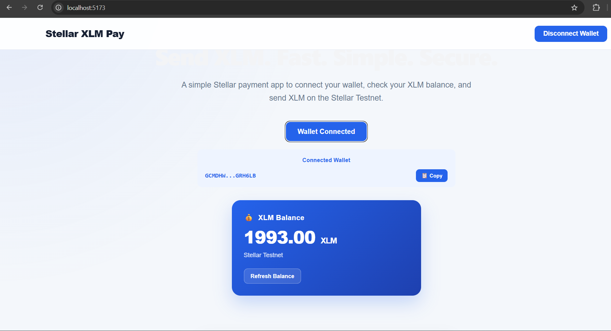
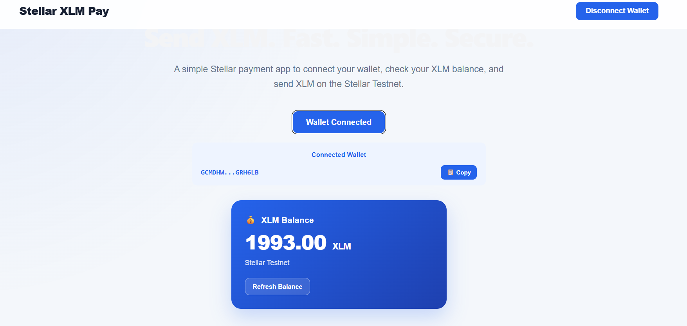
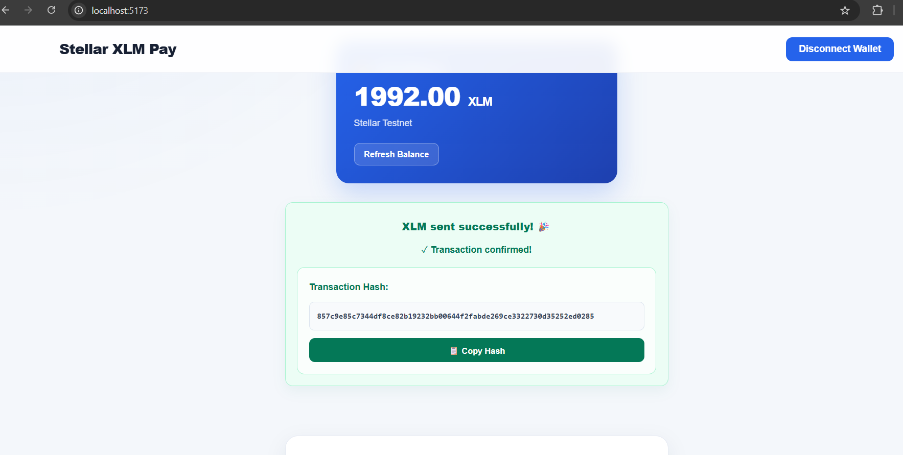
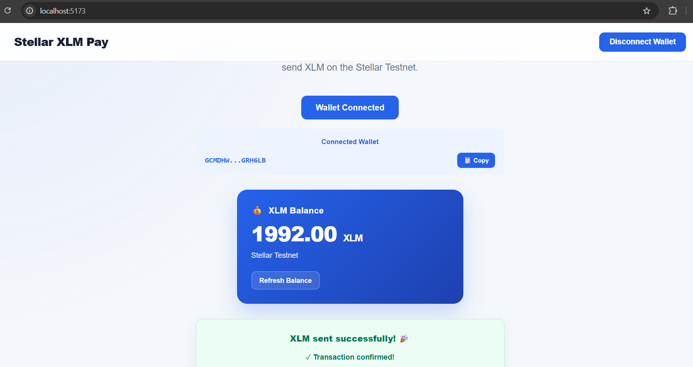

# 🚀 Stellar XLM Pay

### A simple, fast and secure Stellar Testnet payment dApp.

Stellar XLM Pay is a decentralized payment application that allows users to connect a supported **Stellar wallet**, check their **XLM balance**, send **XLM transactions**, and interact with a deployed **Soroban smart contract** securely on the **Stellar Testnet**.

---

## ✨ Features

- 🔐 **Stellar Wallet Connection**
  - Connect supported Stellar wallets through **Stellar Wallets Kit**.
  - Approve wallet connections securely.
  - Disconnect the connected wallet.

- 💰 **XLM Balance**
  - View the current Stellar Testnet XLM balance.
  - Balance is fetched directly from the Stellar Testnet.

- 🔄 **Refresh Balance**
  - Refresh the wallet balance after transactions.

- 🚀 **Send XLM**
  - Send XLM to another Stellar Testnet address.
  - Validate recipient addresses and XLM amounts before submitting.

- 🦊 **Wallet Transaction Signing**
  - Transactions are securely signed through the connected Stellar wallet.

- ✅ **Transaction Confirmation**
  - Display transaction success or failure status.
  - Show the submitted transaction hash.
  - Copy transaction hashes directly from the application.

- 📜 **Soroban Smart Contract**
  - Interact with a deployed Soroban smart contract.
  - Call the `hello` contract function from the connected wallet.
  - Simulate and prepare the contract transaction through Stellar RPC.
  - Approve the smart contract transaction through the wallet.
  - Display the contract response after successful execution.

- 📋 **Wallet Address Copy**
  - Copy the connected wallet address directly from the application.

- 📱 **Responsive UI**
  - Clean interface designed for desktop and mobile screens.

---

## 🛠️ Tech Stack

| Technology | Purpose |
|---|---|
| ⚛️ React | Frontend UI |
| 🔷 TypeScript | Application logic |
| ⚡ Vite | Development and build tool |
| ⭐ Stellar SDK | Stellar blockchain interaction |
| 👛 Stellar Wallets Kit | Multi-wallet connection and transaction signing |
| 📜 Soroban | Smart contract interaction |
| 🌐 Stellar RPC | Soroban transaction simulation and submission |
| 🎨 CSS | UI styling |
| 🧪 Stellar Testnet | Blockchain network |

---

## 🔄 How It Works

### 💸 XLM Payment Flow

```text
┌─────────────────────────┐
│   Connect Stellar Wallet │
└────────────┬────────────┘
             │
             ▼
┌─────────────────────────┐
│    Fetch XLM Balance    │
└────────────┬────────────┘
             │
             ▼
┌─────────────────────────┐
│   Enter Recipient +     │
│      XLM Amount         │
└────────────┬────────────┘
             │
             ▼
┌─────────────────────────┐
│    Build Transaction    │
└────────────┬────────────┘
             │
             ▼
┌─────────────────────────┐
│   Sign with Wallet      │
└────────────┬────────────┘
             │
             ▼
┌─────────────────────────┐
│    Submit to Testnet    │
└────────────┬────────────┘
             │
             ▼
┌─────────────────────────┐
│ Transaction Hash +      │
│    Success Message      │
└─────────────────────────┘
```

### 📜 Soroban Smart Contract Flow

```text
┌─────────────────────────┐
│   Connect Stellar Wallet │
└────────────┬────────────┘
             │
             ▼
┌─────────────────────────┐
│  Call Hello Contract    │
└────────────┬────────────┘
             │
             ▼
┌─────────────────────────┐
│  Simulate Contract Call │
│      through RPC        │
└────────────┬────────────┘
             │
             ▼
┌─────────────────────────┐
│ Prepare Contract        │
│      Transaction        │
└────────────┬────────────┘
             │
             ▼
┌─────────────────────────┐
│ Wallet Confirmation     │
└────────────┬────────────┘
             │
             ▼
┌─────────────────────────┐
│ Submit to Stellar       │
│        Testnet          │
└────────────┬────────────┘
             │
             ▼
┌─────────────────────────┐
│ Contract Response +     │
│   Transaction Hash      │
└─────────────────────────┘
```

---

## ⚙️ Getting Started

### 1. Prerequisites

Make sure you have:

- Node.js
- npm
- A Chromium-based browser
- A compatible Stellar wallet
- A Stellar Testnet account

### 2. Clone the Repository

```bash
git clone https://github.com/Aman-356236/Stellar-XLM-Pay.git
```

### 3. Enter the Project

```bash
cd Stellar-XLM-Pay
```

### 4. Install Dependencies

```bash
npm install
```

### 5. Start Development Server

```bash
npm run dev
```

Open the local URL shown in your terminal.

---

## 👛 Stellar Wallet Setup

1. Install a supported Stellar wallet.
2. Create or import a Stellar wallet.
3. Switch the wallet network to **Testnet**.
4. Open the Stellar XLM Pay application.
5. Click **Connect Wallet**.
6. Select your preferred supported wallet.
7. Approve the wallet connection.

> ⚠️ This application uses the **Stellar Testnet**. Do not use real funds.

---

## 💸 Sending XLM

1. Connect your Stellar wallet.
2. Enter the recipient's Stellar address.
3. Enter the amount of XLM.
4. Click **Send XLM**.
5. Confirm the transaction in your wallet.
6. Wait for the transaction to be submitted.
7. View the transaction hash in the application.
8. Refresh the balance if required.

---

## 📜 Soroban Smart Contract

Stellar XLM Pay also integrates with a deployed **Soroban smart contract** on the Stellar Testnet.

### Smart Contract Function

The deployed contract exposes the following function:

```rust
pub fn hello(env: Env, to: String) -> Vec<String>
```

The frontend calls the `hello` function with the value:

```text
Aman
```

The application then displays the contract response:

```text
Hello, Aman
```

### Smart Contract Flow

The application:

1. Connects the user's Stellar wallet.
2. Creates the Soroban contract invocation.
3. Passes the `Aman` string argument.
4. Simulates the transaction using Stellar RPC.
5. Prepares the transaction.
6. Requests wallet approval.
7. Submits the signed transaction to Stellar Testnet.
8. Waits for transaction confirmation.
9. Displays the contract response.
10. Displays the smart contract transaction hash.

### Deployed Contract

```text
Contract ID:
CBHIDPEYSZ2M6CHXD2JTYT4ZNFAXWBYDCO6E2JDHSN4OH65QCZS5BR5R
```

### Contract Network

```text
Stellar Testnet
```

---

## 📸 Screenshots

### 🔐 Wallet Connected



### 💰 Balance Displayed



### ✅ Successful Transaction



### 📋 Transaction Result



---

## 🌐 Stellar Testnet

This project currently runs on the **Stellar Testnet**.

### Horizon Endpoint

```text
https://horizon-testnet.stellar.org
```

### Soroban RPC Endpoint

```text
https://soroban-testnet.stellar.org
```

All transactions and smart contract interactions made through this application are test transactions.

---

## 🧪 Tested XLM Transaction

The application has been successfully tested with a real **1 XLM Testnet transaction**.

### Tested Flow

```text
Wallet Connected
       ↓
Balance Fetched
       ↓
1 XLM Entered
       ↓
Wallet Confirmation
       ↓
Transaction Submitted
       ↓
Success Message
       ↓
Transaction Hash Generated
```

### Result

**Transaction Status:** ✅ Successful

**Network:** Stellar Testnet

**Amount:** 1 XLM

**Transaction Hash:**

```text
adc5b2369ef852a9e8301036c218538c650f5ccd0a7309f3f2f07a70d3d51b40
```

---

## 🧪 Tested Soroban Contract

The Soroban smart contract integration has also been successfully tested on the **Stellar Testnet**.

### Tested Flow

```text
Wallet Connected
       ↓
Call Hello Contract
       ↓
Contract Simulation
       ↓
Transaction Prepared
       ↓
Wallet Confirmation
       ↓
Contract Transaction Submitted
       ↓
Transaction Confirmed
       ↓
"Hello, Aman"
       ↓
Transaction Hash Generated
```

### Result

**Contract Status:** ✅ Successful

**Network:** Stellar Testnet

**Function:** `hello`

**Input:**

```text
Aman
```

**Contract Response:**

```text
Hello, Aman
```

---

## 🔐 Security

- 🔒 Private keys are never requested by the application.
- 🔒 Wallet transactions require user approval.
- 🔒 Never share your wallet secret key.
- 🔒 Never share your recovery phrase.
- 🔒 Never commit private keys or secrets to GitHub.
- 🧪 Use Stellar Testnet accounts for testing.

---

## 📁 Project Structure

```text
Stellar-XLM-Pay/
│
├── public/
│
├── screenshots/
│   ├── wallet-connected.png
│   ├── balance-displayed.png
│   ├── successful-transaction.png
│   └── transaction-result.png
│
├── src/
│   ├── assets/
│   ├── App.tsx
│   ├── App.css
│   ├── index.css
│   └── main.tsx
│
├── .gitignore
├── index.html
├── package.json
├── package-lock.json
├── tsconfig.json
├── tsconfig.app.json
├── tsconfig.node.json
├── vite.config.ts
└── README.md
```

---

## 🚧 Future Improvements

- 📜 Transaction history
- 🔎 Stellar transaction explorer links
- 👥 Saved recipient addresses
- ⏳ Better transaction loading states
- ⚠️ Improved error handling
- 🌐 Network selection
- 👛 Additional wallet support
- 🎨 Further UI improvements

---

## 👨‍💻 Author

### Aman Mondal

**GitHub:**  
https://github.com/Aman-356236

**Project Repository:**  
https://github.com/Aman-356236/Stellar-XLM-Pay

---

## 📄 License

This project is created for educational and development purposes.

---

### ⭐ If you find this project useful, consider giving the repository a star!