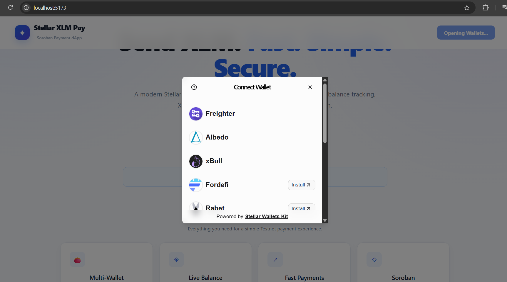
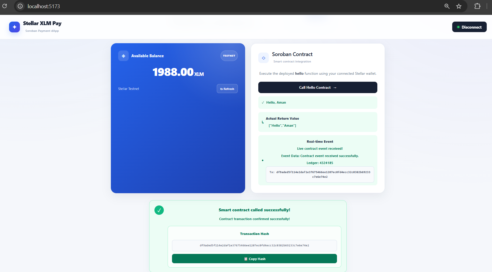
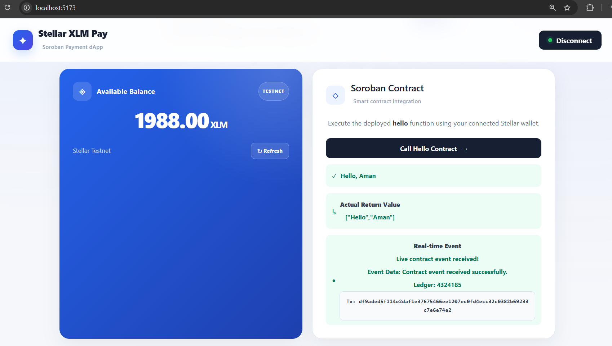

# 🚀 Stellar XLM Pay

### A simple, fast and secure Stellar Testnet payment dApp.

Stellar XLM Pay is a decentralized payment application that allows users to connect supported **Stellar wallets**, check their **XLM balance**, send **XLM transactions**, and interact with a deployed **Soroban smart contract** securely on the **Stellar Testnet**.

The application also demonstrates **multi-wallet integration, smart contract invocation, actual contract return-value reading, real-time contract event handling, and transaction status tracking**.

## Orange Belt submission status

This repository is the Orange Belt iteration. It preserves the existing payment and `hello` contract behavior while adding a tested cross-contract activity registry, a typed event listener compatible with the current Stellar SDK, frontend unit tests, combined CI, and a repeatable Testnet deployment script.

| Orange Belt requirement | Current implementation | Remaining manual evidence |
| --- | --- | --- |
| Advanced contracts and inter-contract communication | `hello-world` configures and calls `activity-registry` through a typed Soroban client; failures do not commit the counter update. | Deploy the current pair to Testnet. |
| Event streaming and real-time updates | The frontend polls Soroban RPC every four seconds, deduplicates contract events, and displays event payload, ledger, and transaction hash. | Capture a live-event screenshot after deployment. |
| Frontend error/loading states | Wallet, payment, contract-call, balance-refresh, copy, and event-reconnect states are represented in the UI. | None. |
| Frontend tests | Vitest validates payment input, self-payment prevention, 7-decimal XLM precision, and fee reserve behavior (5 tests). | None. |
| Contract tests | 9 Rust tests cover contract behavior, registry persistence, authorization, events, and rollback on external-call failure. | None. |
| CI/CD | GitHub Actions runs frontend tests/lint/build and contract format/test/build; built WASM files are uploaded as artifacts. | Push the branch and capture the successful Actions run. |
| Deployment workflow | `scripts/deploy-testnet.ps1` builds, deploys, initializes, and connects both contracts without persisting a secret. | Run it with a funded Testnet account and record both IDs/transaction hashes. |
| Mobile responsive UI | Existing layout has 850px, 600px, and 420px breakpoints for cards, forms, grids, wallet controls, and footer. | Capture a phone-width screenshot. |
| Live demo and video | The app can be served with Vite; a 1–2 minute recording outline is included below. | Publish a hosting URL and record/upload the video. |

### Configuration

The app uses Testnet defaults and supports build-time overrides. Copy no secrets into these values:

```bash
VITE_HELLO_CONTRACT_ID=<deployed-hello-contract-id>
VITE_HORIZON_URL=https://horizon-testnet.stellar.org
VITE_SOROBAN_RPC_URL=https://soroban-testnet.stellar.org
```

The checked-in default Hello contract ID is `CBR2BJNOVWPBPZX44LH5YNXXJ3FAMZ4XTRHO3UVBYRDNQJBZUEVZAUXI`. The current registry integration must be deployed and configured using the script below before the frontend can call `hello_and_record` on a newly deployed pair.

### Testnet deployment workflow

The deployment script intentionally requires credentials only in the current shell and never writes them into the repository:

```powershell
$env:STELLAR_SECRET_KEY = "S..." # funded Testnet account; do not commit this
$env:STELLAR_PUBLIC_KEY = "G..." # matching public key
.\scripts\deploy-testnet.ps1
```

It prints the registry and Hello contract IDs after it deploys, initializes the Hello contract admin, and configures the registry address. Update `VITE_HELLO_CONTRACT_ID` with the printed Hello contract ID before building the hosted frontend.

### Quality checks

```bash
npm test
npm run lint
npm run build

cd contracts
cargo fmt --all -- --check
cargo test --workspace
stellar contract build --locked
```

### Demo recording outline (1–2 minutes)

1. Show the GitHub repository, README, and green GitHub Actions run.
2. Open the mobile-width frontend, connect a Testnet wallet, and show its XLM balance.
3. Send a small Testnet XLM payment and open its transaction hash in a Stellar explorer.
4. Call the deployed contract, show the return value and live event (payload, ledger, and hash).
5. Show the two deployed contract addresses and the deployment transaction in the explorer.

### Submission links to add after manual deployment

| Evidence | Value |
| --- | --- |
| Live demo | Add the public hosting URL after publishing. |
| Activity registry contract | Add the Testnet address printed by the deployment script. |
| Hello contract | Add the Testnet address printed by the deployment script. |
| Deployment transaction | Add the resulting Testnet transaction hash. |
| Mobile screenshot | Add a genuine phone-width screenshot. |
| CI screenshot | Add a screenshot of the green GitHub Actions workflow. |
| Demo video | Add the public 1–2 minute recording URL. |

---

## ✨ Features

- 🔐 **Stellar Wallet Connection**
  - Connect supported Stellar wallets through **Stellar Wallets Kit**.
  - Display available wallet options.
  - Approve wallet connections securely.
  - Disconnect the connected wallet.

- 💰 **XLM Balance**
  - View the current Stellar Testnet XLM balance.
  - Balance is fetched directly from the Stellar Testnet.

- 🔄 **Refresh Balance**
  - Refresh the wallet balance after transactions.

- 🚀 **Send XLM**
  - Send XLM to another Stellar Testnet address.
  - Validate recipient addresses and XLM amounts before submitting.
  - Prevent sending more XLM than the available balance.

- 🦊 **Wallet Transaction Signing**
  - Transactions are securely signed through the connected Stellar wallet.
  - The application never requests or stores private keys.

- ✅ **Transaction Status Tracking**
  - Display transaction preparation status.
  - Display wallet approval status.
  - Display submission status.
  - Display success or failure status.
  - Show the submitted transaction hash.
  - Copy transaction hashes directly from the application.

- 📜 **Soroban Smart Contract**
  - Interact with a deployed Soroban smart contract.
  - Call the `hello` contract function from the connected wallet.
  - Simulate and prepare the contract transaction through Stellar RPC.
  - Approve the smart contract transaction through the wallet.
  - Read the actual contract return value.
  - Display the returned contract data.

- 📡 **Real-Time Contract Events**
  - Listen for the `hello` contract event after successful execution.
  - Display the received event data.
  - Display the ledger associated with the event.
  - Display the contract-call transaction hash.
  - Synchronize contract state with the frontend in real time.

- 📋 **Wallet Address Copy**
  - Copy the connected wallet address directly from the application.

- 📱 **Responsive UI**
  - Clean interface designed for desktop and mobile screens.

- ⚠️ **Error Handling**
  - Wallet rejected/not available.
  - Transaction rejected or failed.
  - Insufficient XLM balance.
  - Invalid recipient or amount.
  - Smart contract transaction errors.

---

## 🛠️ Tech Stack

| Technology | Purpose |
|---|---|
| ⚛️ React | Frontend UI |
| 🔷 TypeScript | Application logic |
| ⚡ Vite | Development and build tool |
| ⭐ Stellar SDK | Stellar blockchain interaction |
| 👛 Stellar Wallets Kit | Multi-wallet connection and transaction signing |
| 📜 Soroban | Smart contract interaction |
| 🌐 Stellar RPC | Soroban transaction simulation and submission |
| 🎨 CSS | UI styling |
| 🦀 Rust | Soroban smart contract development |
| 🧪 Stellar Testnet | Blockchain network |

---

## 🔄 How It Works

### 💸 XLM Payment Flow

```text
┌─────────────────────────┐
│   Connect Stellar Wallet │
└────────────┬────────────┘
             │
             ▼
┌─────────────────────────┐
│    Fetch XLM Balance    │
└────────────┬────────────┘
             │
             ▼
┌─────────────────────────┐
│   Enter Recipient +     │
│      XLM Amount         │
└────────────┬────────────┘
             │
             ▼
┌─────────────────────────┐
│    Build Transaction    │
└────────────┬────────────┘
             │
             ▼
┌─────────────────────────┐
│    Sign with Wallet     │
└────────────┬────────────┘
             │
             ▼
┌─────────────────────────┐
│   Submit to Testnet     │
└────────────┬────────────┘
             │
             ▼
┌─────────────────────────┐
│ Transaction Hash +      │
│    Success Message      │
└─────────────────────────┘
```

### 📜 Soroban Smart Contract Flow

```text
┌─────────────────────────┐
│   Connect Stellar Wallet │
└────────────┬────────────┘
             │
             ▼
┌─────────────────────────┐
│  Call Hello Contract    │
└────────────┬────────────┘
             │
             ▼
┌─────────────────────────┐
│  Simulate Contract Call │
│      through RPC        │
└────────────┬────────────┘
             │
             ▼
┌─────────────────────────┐
│ Prepare Contract        │
│      Transaction        │
└────────────┬────────────┘
             │
             ▼
┌─────────────────────────┐
│ Wallet Confirmation     │
└────────────┬────────────┘
             │
             ▼
┌─────────────────────────┐
│ Submit to Stellar       │
│        Testnet          │
└────────────┬────────────┘
             │
             ▼
┌─────────────────────────┐
│ Read Contract Return    │
│        Value             │
└────────────┬────────────┘
             │
             ▼
┌─────────────────────────┐
│ Detect Contract Event   │
│      in Real Time       │
└────────────┬────────────┘
             │
             ▼
┌─────────────────────────┐
│ Event Data + Ledger +   │
│    Transaction Hash     │
└─────────────────────────┘
```

---

## ⚙️ Getting Started

### 1. Prerequisites

Make sure you have:

- Node.js
- npm
- A Chromium-based browser
- A compatible Stellar wallet
- A Stellar Testnet account

### 2. Clone the Repository

```bash
git clone https://github.com/Aman-356236/Stellar-XLM-Pay.git
```

### 3. Enter the Project

```bash
cd Stellar-XLM-Pay
```

### 4. Install Dependencies

```bash
npm install
```

### 5. Start Development Server

```bash
npm run dev
```

Open the local URL shown in your terminal.

---

## 👛 Stellar Wallet Setup

1. Install a supported Stellar wallet.
2. Create or import a Stellar wallet.
3. Switch the wallet network to **Testnet**.
4. Open the Stellar XLM Pay application.
5. Click **Connect Wallet**.
6. Select your preferred supported wallet from the wallet options.
7. Approve the wallet connection.

> ⚠️ This application uses the **Stellar Testnet**. Do not use real funds.

---

## 📸 Wallet Options

The application uses **Stellar Wallets Kit** to provide a multi-wallet connection experience.

When the user selects **Connect Wallet**, the wallet selection interface is displayed.



---

## 💸 Sending XLM

1. Connect your Stellar wallet.
2. Enter the recipient's Stellar address.
3. Enter the amount of XLM.
4. Click **Send XLM**.
5. Confirm the transaction in your wallet.
6. Wait for the transaction to be submitted.
7. View the transaction hash in the application.
8. Refresh the balance if required.

---

# 📜 Soroban Smart Contract

Stellar XLM Pay integrates with a deployed **Soroban smart contract** on the Stellar Testnet.

## Smart Contract Function

The deployed contract exposes the following function:

```rust
pub fn hello(env: Env, to: String) -> Vec<String>
```

The frontend calls the `hello` function with:

```text
Aman
```

The contract returns the actual value:

```text
["Hello", "Aman"]
```

The frontend reads this returned value and displays it as:

```text
Actual Return Value

["Hello","Aman"]
```

---

## 📡 Real-Time Contract Event

The `hello` function also emits a contract event when it is successfully executed.

The frontend detects and displays the received event information.

Example successful event:

```text
Real-time Event

Live contract event received!

Event Data:
Contract event received successfully.

Ledger:
4316360

Transaction:
0ecb6ed10f29fe879c05849a0dd500738068a20d19226e1cf60663252ed79239
```

This demonstrates real-time contract event integration and frontend state synchronization.

---

## 🔄 Smart Contract Flow

The application:

1. Connects the user's Stellar wallet.
2. Creates the Soroban contract invocation.
3. Passes the `Aman` string argument.
4. Simulates the transaction using Stellar RPC.
5. Prepares the transaction.
6. Requests wallet approval.
7. Submits the signed transaction to Stellar Testnet.
8. Waits for transaction confirmation.
9. Reads the actual contract return value.
10. Displays `["Hello","Aman"]`.
11. Detects the emitted contract event.
12. Displays the event data.
13. Displays the associated ledger.
14. Displays the contract transaction hash.

---

## 🧾 Deployed Contract

### Contract ID

```text
CBR2BJNOVWPBPZX44LH5YNXXJ3FAMZ4XTRHO3UVBYRDNQJBZUEVZAUXI
```

### Network

```text
Stellar Testnet
```

### Contract Function

```text
hello
```

### Contract Input

```text
Aman
```

### Actual Contract Return Value

```text
["Hello","Aman"]
```

---

## 🔎 Verified Contract Call

The smart contract has been successfully called from the frontend on the Stellar Testnet.

### Contract Call Transaction Hash

```text
0ecb6ed10f29fe879c05849a0dd500738068a20d19226e1cf60663252ed79239
```

### Event Ledger

```text
4316360
```

The contract-call transaction can be verified on the Stellar Testnet explorer.

---

## 📸 Screenshots

### 🔐 Wallet Options


### 🔐 Wallet Connected


### 💰 Balance Displayed


### ✅ Successful Transaction


### 📋 Transaction Result


### 📜 Soroban Contract Call



### 📡 Real-Time Contract Event



> Add the corresponding screenshots to the `screenshots/` folder before submitting.

---

## 🌐 Stellar Testnet

This project currently runs on the **Stellar Testnet**.

### Horizon Endpoint

```text
https://horizon-testnet.stellar.org
```

### Soroban RPC Endpoint

```text
https://soroban-testnet.stellar.org
```

All transactions and smart contract interactions made through this application are test transactions.

---

# 🧪 Tested XLM Transaction

The application has been successfully tested with a real **1 XLM Testnet transaction**.

### Tested Flow

```text
Wallet Connected
       ↓
Balance Fetched
       ↓
1 XLM Entered
       ↓
Wallet Confirmation
       ↓
Transaction Submitted
       ↓
Success Message
       ↓
Transaction Hash Generated
```

### Result

**Transaction Status:** ✅ Successful

**Network:** Stellar Testnet

**Amount:** 1 XLM

**Transaction Hash:**

```text
adc5b2369ef852a9e8301036c218538c650f5ccd0a7309f3f2f07a70d3d51b40
```

---

# 🧪 Tested Soroban Contract

The Soroban smart contract integration has been successfully tested on the **Stellar Testnet**.

### Tested Flow

```text
Wallet Connected
       ↓
Call Hello Contract
       ↓
Contract Simulation
       ↓
Transaction Prepared
       ↓
Wallet Confirmation
       ↓
Contract Transaction Submitted
       ↓
Transaction Confirmed
       ↓
Actual Return Value Read
       ↓
["Hello","Aman"]
       ↓
Contract Event Detected
       ↓
Event Data Displayed
       ↓
Transaction Hash Displayed
```

### Result

**Contract Status:** ✅ Successful

**Network:** Stellar Testnet

**Function:** `hello`

**Input:**

```text
Aman
```

**Actual Return Value:**

```text
["Hello","Aman"]
```

**Event Status:** ✅ Received

**Event Ledger:**

```text
4316360
```

**Contract Transaction Hash:**

```text
0ecb6ed10f29fe879c05849a0dd500738068a20d19226e1cf60663252ed79239
```

---

# 🛡️ Level 2 Requirements

This project implements the major requirements of the Stellar Level 2 Yellow Belt submission.

| Requirement | Status |
|---|---|
| Multi-wallet integration | ✅ Complete |
| Stellar Wallets Kit | ✅ Complete |
| Error handling | ✅ Complete |
| Contract deployed on Testnet | ✅ Complete |
| Contract called from frontend | ✅ Complete |
| Transaction status visible | ✅ Complete |
| Contract return value read | ✅ Complete |
| Real-time contract event integration | ✅ Complete |
| Event data displayed | ✅ Complete |
| Contract transaction hash | ✅ Complete |
| Public GitHub repository | ✅ Complete |
| Meaningful commits | ✅ Complete |

---

## 🔐 Security

- 🔒 Private keys are never requested by the application.
- 🔒 Wallet transactions require user approval.
- 🔒 Never share your wallet secret key.
- 🔒 Never share your recovery phrase.
- 🔒 Never commit private keys or secrets to GitHub.
- 🧪 Use Stellar Testnet accounts for testing.

---

## 📁 Project Structure

```text
Stellar-XLM-Pay/

│
├── contracts/
│   └── contracts/
│       └── hello-world/
│           ├── src/
│           │   ├── lib.rs
│           │   └── test.rs
│           └── Cargo.toml
│
├── public/
│
├── screenshots/
│   ├── wallet-options.png
│   ├── wallet-connected.png
│   ├── balance-displayed.png
│   ├── successful-transaction.png
│   ├── transaction-result.png
│   ├── contract-call.png
│   └── contract-event.png
│
├── src/
│   ├── assets/
│   ├── App.tsx
│   ├── App.css
│   ├── index.css
│   └── main.tsx
│
├── .gitignore
├── index.html
├── package.json
├── package-lock.json
├── tsconfig.json
├── tsconfig.app.json
├── tsconfig.node.json
├── vite.config.ts
└── README.md
```

---

## 🚧 Future Improvements

- 📜 Transaction history
- 🔎 Direct Stellar Explorer links
- 👥 Saved recipient addresses
- 🌐 Network selection
- 👛 Additional wallet integrations
- 📊 Advanced contract event history
- 🔔 Persistent real-time activity feed
- 🎨 Further UI improvements

---

## 👨‍💻 Author

### Aman Mondal

**GitHub:**  
https://github.com/Aman-356236

**Project Repository:**  
https://github.com/Aman-356236/Stellar-XLM-Pay

---

## 📄 License

This project is created for educational and development purposes.

---

### ⭐ If you find this project useful, consider giving the repository a star!
